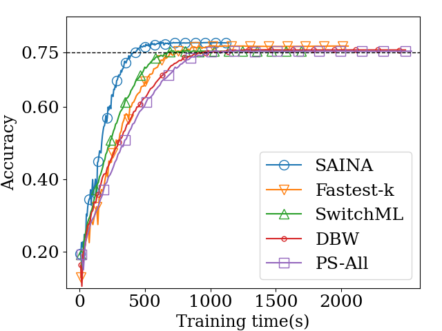
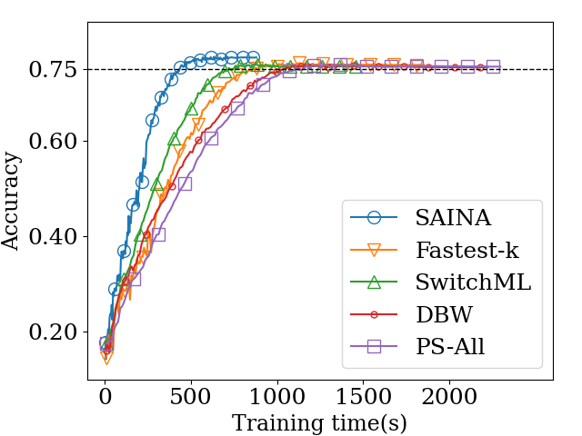
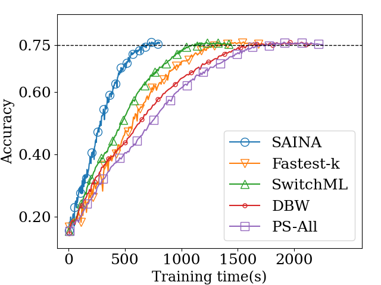
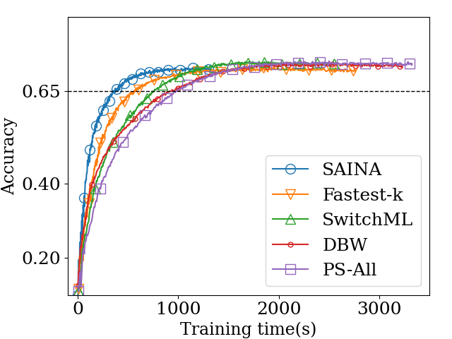
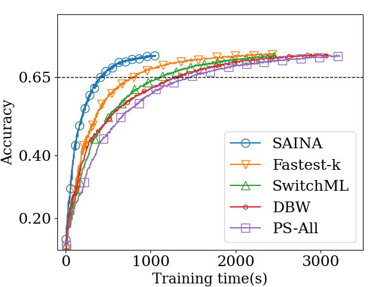
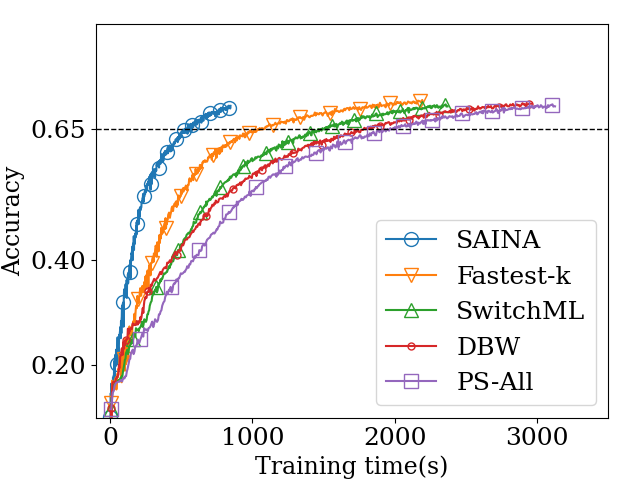

# SAINA
Straggler-Aware In-Network Aggregation (SAINA) mitigates the straggler problem in distributed deep learning while preventing accuracy degradation. It aggregates local gradients of the fastest $k$ workers to exclude stragglers
and changes $k$ adaptively to balance the tradeoff between training speed and accuracy.

We proposed Switch-Friendly Convergence Detection (SFCD) algorithm which detects a convergence point and increases $k$ incrementally whenever a training error reaches the convergence point. The SFCD algorithm employs a simple bitwise operation on the signs of global gradients, which is supported by commodity programmable switches and thus it can be implemented practically. Simulation results demonstrate that SAINA can reduce the waiting time for stragglers and shows higher time-to-accuracy (TTA) performance than the existing in-network aggregation scheme and the straggler mitigation schemes.

The source code of SAINA was implemented on top of [SwitchML](https://github.com/p4lang/p4app-switchML).

# Performance Results
### Time-to-Accuracy Performance (VGG-16)

| Batch Size = 16 | Batch Size = 32 | Batch Size = 64 |
|------------------|------------------|------------------|
|  |  |  |

### Time-to-Accuracy Performance (SqueezeNet)

| Batch Size = 16 | Batch Size = 32 | Batch Size = 64 |
|------------------|------------------|------------------|
|  |  |  |

### Time-to-Accuracy Performance (ResNet50)

| Batch Size = 16 | Batch Size = 32 | Batch Size = 64 |
|------------------|------------------|------------------|
<!-- |  |  |  | -->

### Effect of SFCD Algorithm

| Scheme              | VGG-16 Final Accuracy | VGG-16 TTA Reduction     |
|---------------------|----------------------|----------------------|
| SAINA ($k$=1)       | 73.9%                | -                    |
| SAINA ($k$=8)       | 76.3%                | 1.51x                |
| SAINA ($k^*$)       | 78.0%                | 1.70x                |

| Scheme              | SqueezeNet Final Accuracy | SqueezeNet TTA Reduction |
|---------------------|--------------------------|--------------------------|
| SAINA ($k$=1)       | 70.1%                    | 2.28x                    |
| SAINA ($k$=8)       | 72.2%                    | 2.15x                    |
| SAINA ($k^*$)       | 72.5%                    | 2.84x                    |

In the above table, Final Accuracy means the accuracy when all training is completed, and TTA Reduction means how much TTA was reduced compared to when k=16 was set. 
